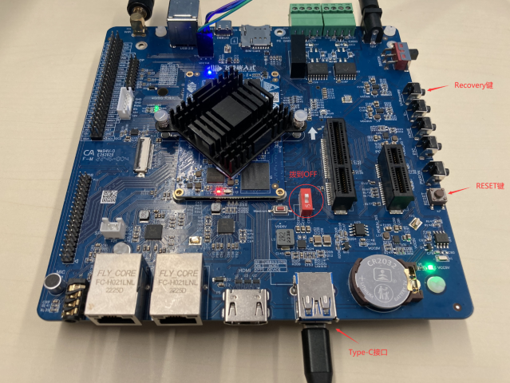
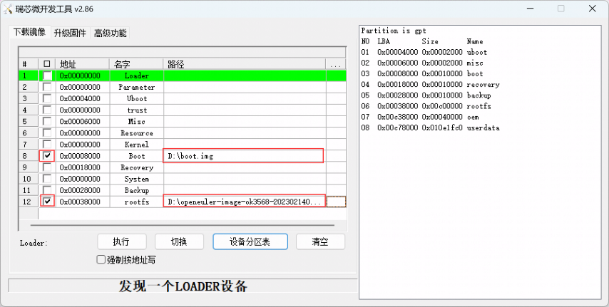
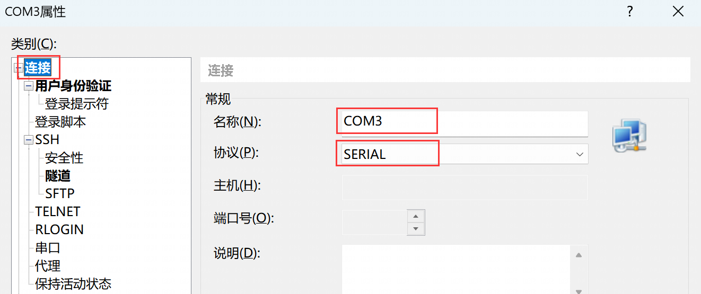

.. _board_rk3568_build:

RK3568板卡镜像构建与使用
######################################

本章主要介绍openEuler Embedded中RK3568系列板卡的构建，使用和特性介绍。

RK3568镜像构建指导
***********************************

**构建指导**

- 参照 :ref:`openeuler_embedded_oebuild` 完成oebuild安装，并详细了解构建过程

- 依次执行以下命令完成构建

  .. code-block:: console

    # 生成ok3568配置文件
    oebuild generate -p ok3568

    #或生成ryd-3568配置文件
    oebuild generate -p ryd-3568

    # 进入构建交互终端
    oebuild bitbake

    # 构建镜像
    bitbake openeuler-image

    # 构建sdk
    bitbake openeuler-image -c populate_sdk

- 二进制介绍：

  1. Image: 飞凌ok3568内核镜像

  2. openeuler-glibc-x86_64-openeuler-image-aarch64-ok3568-toolchain-22.09\*.sh: SDK工具链

  3. boot\*.img: openEuler Embedded 适用ok3568内核镜像

  4. openeuler-image-ok3568-\*.rootfs.ext4: 适用ok3568根文件系统

镜像使用方法
***********************************

1.镜像使用

1) 镜像烧录前查看/修改文件

创建挂载目录

.. code-block:: console

  mkdir ${WORKDIR}/rootfs

挂载rootfs

.. code-block:: console

  mount -t ext4 openeuler-image-ok3568-\*.rootfs.ext4 ${WORKDIR}/rootfs

挂载完成后，可以查看OK3568根文件系统的文件。

2.镜像烧录:

- windows

  将文件DriverAssitant_v5.11.zip解压到任意目录，以管理员权限运行打开DriverInstall.exe 程序，然后点击“驱动安装”进行安装。

.. image:: install_driver1.png

.. image:: install_driver2.png

.. image:: install_driver3.png

内核镜像和文件系统烧写方法
***********************************

1. 将瑞芯微开发工具RKDevTool_Release.zip解压到全英文路径下，打开瑞芯微开发工具RKDevTool，使用 Type-C 线连接开发板和主机，按住开发板的 Recovery键不要松开，然后按下 RESET键系统复位，大约两秒后松开 Recovery键，瑞芯微开发工具 RKDevTool_将提示发现 LOADER设备。

.. image:: RKDevTool1.png

2. 点击“设备分区表”按钮，将自动读取分区地址。会有某些分区读不到的提示，点击确定即可。

.. image:: device_parted_scan.png

在地址栏右键选择添加项，添加文件系统的地址。

3. 勾选Boot和rootfs，并选择Boot和rootfs的路径。

4. 点击“执行”按钮将自动烧写内核和文件系统，并重新启动。

.. image:: start_burning.png

基于openEuler Embedded OK3568使用
**********************************************

启用OK3568
***********************************

硬件版本要求：飞凌OK3568

默认用户名：root，密码：第一次启动没有默认密码，需重新配置，且密码强度有相应要求， 需要数字、字母、特殊字符组合最少8位，例如openEuler@2021。

将刷写镜像后的OK3568核心板通电启用。

**OK3568登录方式**

1.本地登录

a.使用串口登录：

镜像使能了串口登录功能，按照ok3568的串口连接方式，如下图，可以启用串口操作。

示例：使用ttyusb转接器，将OK3568的串口通过USB连接到putty：

.. image:: console_link.png

b.使用HDMI登录：

OK3568连接显示器（OK3568视频输出接口为HDMI）、键盘、鼠标后，启动OK3568，可以看到OK3568启动日志输出到显示器上。待ok3568启动成功，输入用户名（root）和密码登录。

2.ssh 远程登录

**网络配置**

**启动后无线网卡配置**

使用终端连接工具通过串口连接开发板

.. image:: console2.png

使用wpa_passphrase 工具将wifi密码加密，生成配置

执行命令：

wpa_passphrase <wifi_name> <password>

.. image:: wpa_passphrase.png

将生成的配置写入配置文件/etc/wpa_supplicant.conf：

执行命令：

.. code-block:: console

   vi /etc/wpa_supplicant.conf

.. image:: wpa_supplicant.png

**启用wifi网卡**

执行命令：

.. code-block:: console

   ifup mlan0

启用wifi网卡后，会自动生成IP，可直接查看网卡信息。

执行命令：ifconfig

.. image:: ifconfig.png

使用ssh命令登录:

.. code-block:: console

   ssh root@x.x.x.x

**分区扩容**

默认根目录分区空间比较小，在使用之前，需要对分区进行扩容（在23.03及其之后的版本中，已实现自动扩容，首次烧录镜像启动会自动执行扩容并提示重启）

以下为手动扩容方法

- 查看磁盘分区信息

执行 fdisk -l 命令查看磁盘分区信息。回显如下：

.. code-block:: console

  Number  Start (sector)    End (sector)  Size Name
  1           16384           24575 4096K uboot
  2           24576           32767 4096K misc
  3           32768           98303 32.0M boot
  4           98304          163839 32.0M recovery
  5          163840          229375 32.0M backup
  6          229376        12812287 6144M rootfs
  7        12812288        13074431  128M oem
  8        13074432        30777279 8643M userdata

对应数据分区为 rootfs，与userdata

ok3568镜像特性介绍
**************************

1.ok3568硬件特性，参考:RK3568手册GPIO

  目前已使能串口设备，可以访问uart，其他硬件特性目前支持、无线网卡、GPU、TF卡、以太网卡、USB Host、SPI、HDMI。

2.支持百级嵌入式软件包，见软件包功能列表。

3.支持部署rt实时内核。