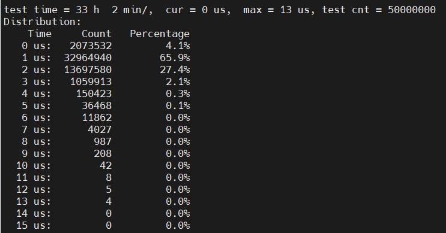

.. _real_time_perform:

1.1 实时性能
####################

1.1.1 中断响应实时延迟
*************************************

测试工具
==============

-  信号发生器

-  GD32单片机开发板

测试方案
==============

使用信号发生器作为中断源，产生1kHz方波，接入结果统计平台(本方案使用GD32单片机开发板)，记时作为中断触发时间。
同时接入RK3586硬件平台外部中断引脚，触发中断并在OEE-RT的中断处理程序中对RK3586的GPIO引脚进行电平翻转，
并将该引脚接入结果统计平台，结果统计平台记时作为中断响应时间。中断响应时间与中断触发时间差值计算得到中断响应延迟。

.. figure:: ../../../image/test_data/1-1.png
            :align: center

            图1-1 硬件连接示意图

测试结果
==============

    对两个操作系统平台分别测试五千万次，得到统计结果如下：

.. list-table:: 表1-1 中断响应延迟结果
    :align: center

    * - **测试对象**
      - **统计次数**
      - **最大时延/us**
      - **≥10us占比**
      - **备注**
    * - OEE-RT
      - 50000000
      - 10
      - 0.000004%
      - ≥10us占比亿分之4
    * - OEE-RT+Jailhouse
      - 50000000
      - 13
      - 0.00000118%
      - ≥10us占比小于百万分之二
      

            图1-2 OEE-RT中断响应延迟统计结果图

            图1-3 OEE-RT+Jailhouse中断响应延迟统计结果图

注：“0us”的统计表示“<1us”的个数

1.1.2 周期调度抖动
*************************************

测试工具
==============

-  stress

-  Kit

-  cyclictest

测试方案
==============

    本轮测试采用cyclictest套件工具。

    执行如下指令运行cyclictest：

    .. code-block:: console

        taskset -c 2 cyclictest -i 1000 -p 99 -t 1 --policy=fifo -h 100 -D 12h > /dev/console &

测试结果
==============

    经过12小时测试，统计结果如下：

.. list-table:: 表1-2 周期调度抖动结果
    :align: center

    * - **测试工具**
      - **测试对象**
      - **统计次数**
      - **最大抖动/us**
      - **≥70us占比**
    * - cyclictest
      - OEE-RT+Jailhouse
      - 43199998
      - 105
      - 0.0000833%
    * - 
      - OEE-RT
      - 43199992
      - 188
      - 0.0002894%
..

    注：cyclictest记录的数据为用户态线程。

1.1.3 信号在多个线程间传递的延迟
*************************************

测试工具
==============

-  signaltest

测试方案
==============

    使用rt-tests的signaltest工具获取信号发送和接收的时间差值。

    设置测试线程优先级为最高的99（多线程的话会依次降低），循环测试一千万次，测试线程数为4，测试指令：

    .. code-block:: console

        taskset -c 2 signaltest -l 1000000 -p 99 -t 4

    指令均在串口终端下执行。
   
测试结果
==============

    统计结果如下：

.. list-table:: 表1-3 信号在多个线程间传递时延的测试结果
    :align: center

    * - **测试工具**
      - **测试项**
      - 
      - **OEE-RT**
      - **OEE-RT+Jailhouse**
    * - signaltest
      - 线程1（优先级99）
      - 最小值（us）
      - 
      - 97
    * - 
      - 
      - 平均值（us）
      - 
      - 100
    * - 
      - 
      - 最大值（us）
      - 
      - 146
    * - 
      - 线程2（优先级99）
      - 最小值（us）
      - 
      - 97
    * - 
      - 
      - 平均值（us）
      - 
      - 727
    * - 
      - 
      - 最大值（us）
      - 
      - 10186
    * - 
      - 线程3（优先级99）
      - 最小值（us）
      - 
      - 96
    * - 
      - 
      - 平均值（us）
      - 
      - 727
    * - 
      - 
      - 最大值（us）
      - 
      - 10189
    * - 
      - 线程4（优先级99）
      - 最小值（us）
      - 
      - 96
    * - 
      - 
      - 平均值（us）
      - 
      - 727
    * - 
      - 
      - 最大值（us）
      - 
      - 10192
